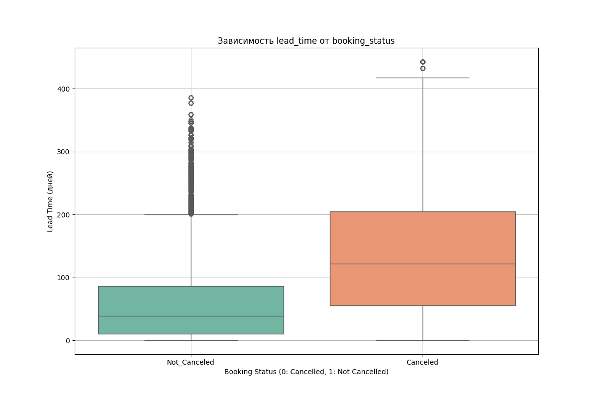

## Проект по предсказанию отмены бронирования
[Ссылка на датасет](https://www.kaggle.com/datasets/ahsan81/hotel-reservations-classification-dataset)


### Установка и запуск
1. Клонируйте репозиторий
```
git clone https://github.com/ArtemKitayskiy/hotel-reservations.git
```
2. Перейдите в папку проекта
```
cd hotel-reservations/
```
2. Создайте виртуальное окружение
```
python -m venv venv
```
3. Активируйте виртуальное окружение
- Windows:

```
.\venv\Scripts\activate
```
- Linux/Mac:
```
source venv/bin/activate
```
4. Установите необходимые зависимости:
```
pip install -r requirements.txt
```
5. Создайте папку data и поместите в нее датасет:
```
mkdir data
```

### Разведочный анализ даных
1) Датасет проверен на наличие дубликатов, отсутствие указанных гостей, отсутствие указаннных ночей проживания, неверную дату прибытия. Найденные строки были удалены.
2) Созданы два новых признака: 
    - является ли день прибытия выходным? (категориальный бинарный признак)
    - отклонение цены за номер от медианной цены (числовой признак)
3) Построены следующие графики:


Чем меньше дней остается до даты прибытия, чем чаще происходит бронирование.   
То есть гости склонны бронировать отели в последний момент.


Бронирование с большим временем до прибытия более подвержены отменам, что логично, так как у людей есть больше времени на то, чтобы обдумать свое решение и поменять его.


- Более трети номеров забронированы на двух взрослых, второе по популярности количество взрослых - 1;
- Около 92% процентов бронируют номера без детей;
- Менее 2% бронируют проживание, захватывающее более одних выходных;
- Распределение количество будних дней имеет положительную ассиметрию, с модой равной 2.


- Популярные месяцы для бронирования - 8,9,10, что странно, ведь этот вериод не является высокосезонным;
- Бронирования на 2018 год преобладают.


Гости с неотмененным бронированием в среднем имеют больше предыдущих неотмененных бронирований.


- Тип 7 имеет наибольший разброс цен, при этом наибольшую медианную цену;
- Тип 1 и тип 2 имеют схожий диапазон цен и невысокий разброс;
- Тип 4 и тип 5 также имеют схожий диапазон цен и невысокий разброс;
- У типа 1 присутствует сильно выраженный выброс.

### Запуск MLflow
1. Перейдите в папку с mlflow:
```
cd ./mlflow
```
2. Запустите скрипт:
```
source ./start_mlflow.sh
```

### Результаты исследования:
Лучшая модель:

- PolynomialFeatures для признаков lead_time, avg_price_per_room;
- KBinsDiscretizer для признаков lead_time, avg_price_per_room;
- StandardScaler для числовых признаков;
- MeanEncoder для категориальных признаков;
- SequentialFeatureSelector для отбора 20 лучших признаков с последовательным добавлением;
- Optuna для подбора гиперпараметров;
- RandomForestClassifier для решения задачи классификации.

Отобранные признаки:  
['poly__lead_time avg_price_per_room',  
 'poly__avg_price_per_room^2',  
 'kbin__lead_time_1.0',  
 'kbin__lead_time_2.0',  
 'kbin__avg_price_per_room_0.0',  
 'kbin__avg_price_per_room_1.0',  
 'num__no_of_adults',  
 'num__no_of_weekend_nights',  
 'num__no_of_week_nights',  
 'num__lead_time',  
 'num__no_of_previous_cancellations',  
 'cat__type_of_meal_plan',  
 'cat__required_car_parking_space',  
 'cat__room_type_reserved',  
 'cat__arrival_year',  
 'cat__arrival_month',  
 'cat__arrival_date',  
 'cat__market_segment_type',  
 'cat__repeated_guest',  
 'cat__no_of_special_requests']

Гиперпараметры:
- max_depth = 30
- max_features = 0.33861
- n_estimators = 190

Метрики:
|           | Score    |
|-----------|----------|
| Precision | 0.881441 |
| Recall    | 0.823846 |
| F1-Score  | 0.851671 |
| ROC AUC   | 0.958859 |

run_id модели Production:  
f1e402c95cd04b429cc8ec80e1311352

### Структура сервиса предсказаний

Папка ml_service:
- main.py - основной файл с FastAPI-приложением
- api_handler.py - файл с классом-обработчиком, который отвечает за загрузку модели и выполнение предсказания
- Dockerfile - файл для сборки Docker-образа
- requirements.txt - файл с зависимостями для работы сервиса

Папка models:
- get_model.py - файл для получения модели из MLflow и записи ее в pickle файл
- model.pkl - обученная модель, которая используется в сервисе для получения предсказаний

### Создание образа и запуск контейнера:
1. Для создания Docker-образа выполните команду:
```
docker build -t ml_service:v1 .
```

2. Для запуска контейнера выполните команду:
```
docker run -d -p 8000:8000 -v $(pwd)/../models:/models --name ml_service_container ml_service:v1
```

### Проверка работоспособности:

Пример запроса:
```
curl -X POST \
-H "Content-Type: application/json" \
-d '{
  "no_of_adults": 2,
  "no_of_children": 0,
  "no_of_weekend_nights": 1,
  "no_of_week_nights": 2,
  "type_of_meal_plan": "Meal Plan 1",
  "required_car_parking_space": false,
  "room_type_reserved": "Room_Type 1",
  "lead_time": 224,
  "arrival_year": 2017,
  "arrival_month": "10",
  "arrival_date": "02",
  "market_segment_type": "Offline",
  "repeated_guest": false,
  "no_of_previous_cancellations": 0,
  "no_of_previous_bookings_not_canceled": 0,
  "avg_price_per_room": 65.0,
  "no_of_special_requests": 0,
  "is_weekend": false,
  "price_deviation": -29.5
}' \
"http://localhost:8000/api/prediction?item_id=1"
```

Ответ:
```
{"item_id":"1","predict":0}
```


