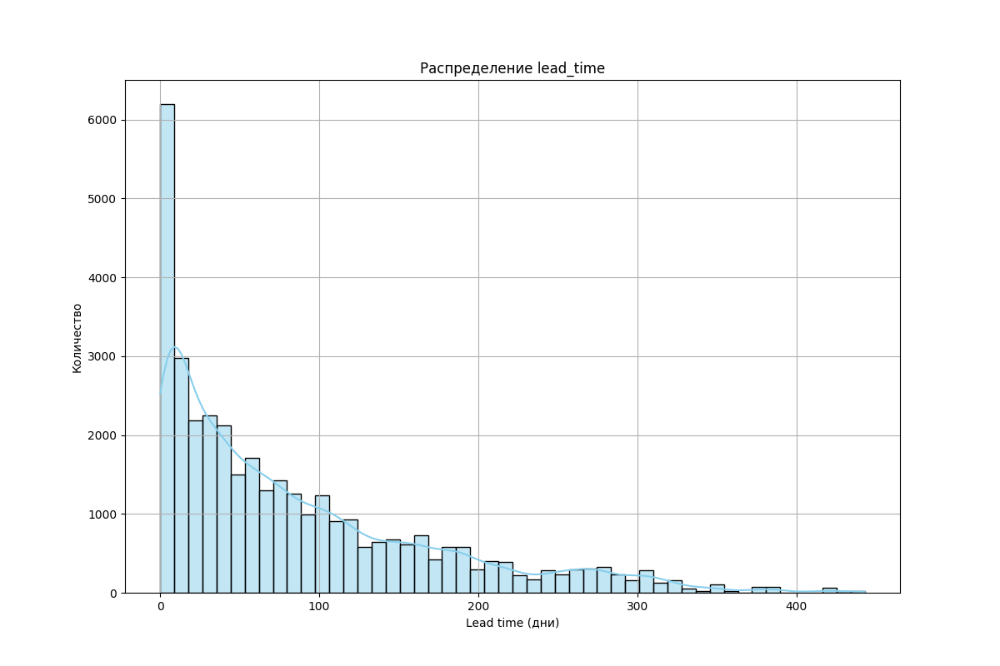
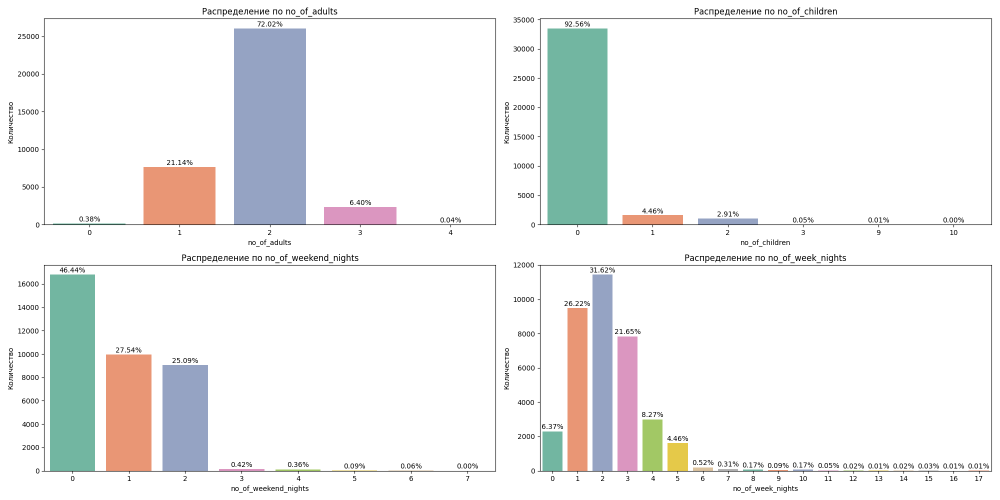
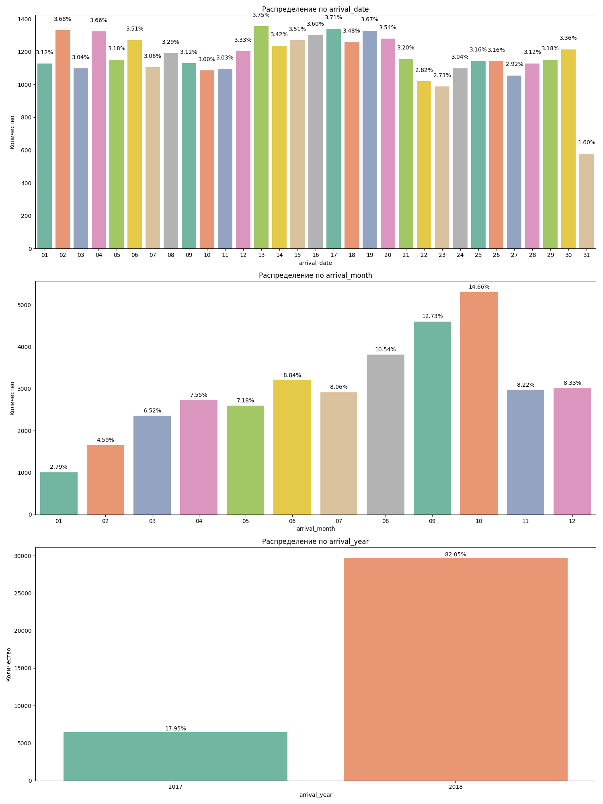
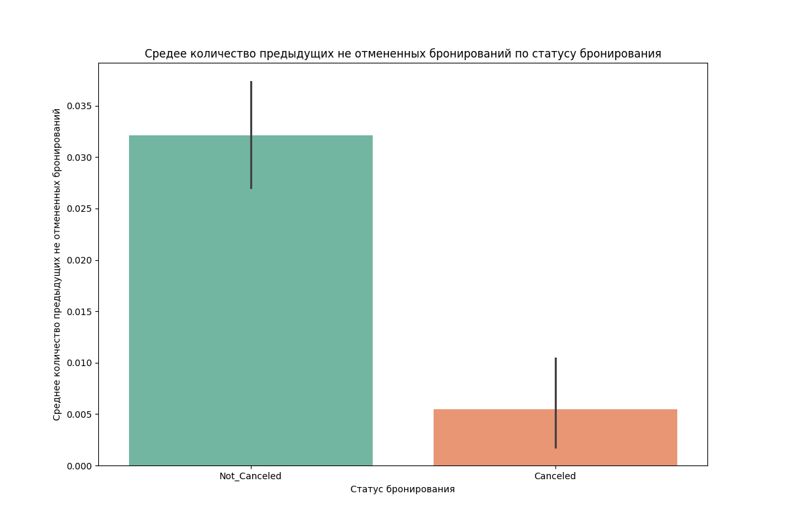
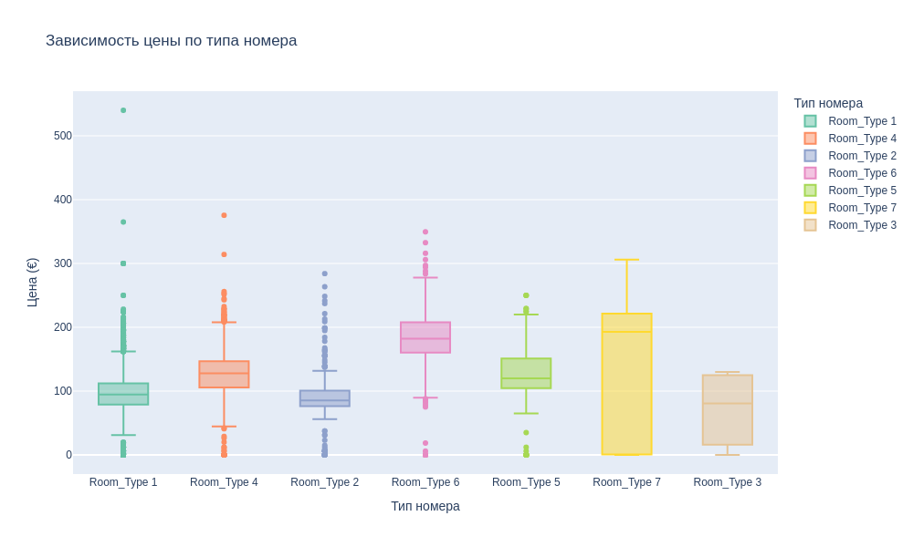

## Проект по предсказанию отмены бронирования
[Ссылка на датасет](kaggle.com/datasets/ahsan81/hotel-reservations-classification-dataset)


### Установка и запуск
1. Клонируйте репозиторий
```
git clone https://github.com/ArtemKitayskiy/hotel-reservations.git
```
2. Перейдите в папку проекта
```
cd hotel-reservations/
```
2. Создайте виртуальное окружение
```
python -m venv venv
```
3. Активируйте виртуальное окружение
- Windows:

```
.\venv\Scripts\activate
```
- Linux/Mac:
```
source venv/bin/activate
```
4. Установите необходимые зависимости:
```
pip install -r requirements.txt
```
5. Создайте папку data и поместите в нее датасет:
```
mkdir data
```

### Разведочный анализ даных
1) Датасет проверен на наличие дубликатов, отсутствие указанных гостей, отсутствие указаннных ночей проживания, неверную дату прибытия. Найденные строки были удалены.
2) Созданы два новых признака: 
    - является ли день прибытия выходным? (категориальный бинарный признак)
    - отклонение цены за номер от медианной цены (числовой признак)
3) Построены следующие графики:


Чем меньше дней остается до даты прибытия, чем чаще происходит бронирование.   
То есть гости склонны бронировать отели в последний момент.


Бронирование с большим временем до прибытия более подвержены отменам, что логично, так как у людей есть больше времени на то, чтобы обдумать свое решение и поменять его.


- Более трети номеров забронированы на двух взрослых, второе по популярности количество взрослых - 1;
- Около 92% процентов бронируют номера без детей;
- Менее 2% бронируют проживание, захватывающее более одних выходных;
- Распределение количество будних дней имеет положительную ассиметрию, с модой равной 2.


- Популярные месяцы для бронирования - 8,9,10, что странно, ведь этот вериод не является высокосезонным;
- Бронирования на 2018 год преобладают.


Гости с неотмененным бронированием в среднем имеют больше предыдущих неотмененных бронирований.


- Тип 7 имеет наибольший разброс цен, при этом наибольшую медианную цену;
- Тип 1 и тип 2 имеют схожий диапазон цен и невысокий разброс;
- Тип 4 и тип 5 также имеют схожий диапазон цен и невысокий разброс;
- У типа 1 присутствует сильно выраженный выброс.


